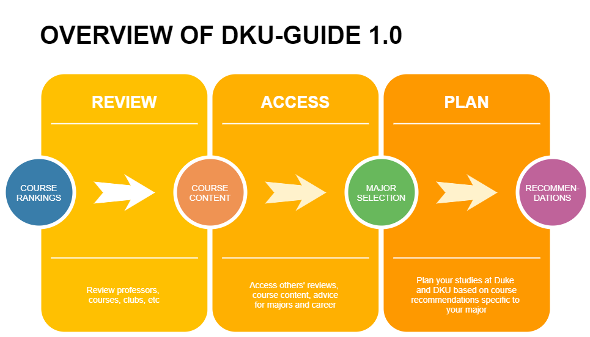

[](https://www.apache.org/licenses/LICENSE-2.0)

# DKU Guide Project

DKU Guide is meant to allow new undergraduate students to make informed decision when choosing courses, preview the course content, and review professors. It will also serve as a guiding resource in choosing major or finding career opportunities relevant to the major. Below is an overview of the project.



### The platform is open-source and anyone's contribution is welcomed!

## How to Setup the application in your computer

### Building Locally

To get started building this application locally, you need to have the following software and tools installed:
* [Maven](https://maven.apache.org/install.html)
* Java 11: Any compliant JVM should work.
* [PostgreSQL](https://www.postgresql.org/download/)

To build and run the application:
1. Set your postgres database URL, USERNAME and PASSWORD in ```config/application.properties```
2. Run ```mvn:verify```
3. Run ```mvn spring-boot:run```
4. Once completed, go to http://localhost:8080 in browser to view the current version of the web app
5. You can also browse the current version of API:
   1. locally: http://localhost:8080/swagger-ui.html
   2. or online https://dku-guide.herokuapp.com/swagger-ui.html (could be not the most recent version)

## License

This sample application is licensed under the Apache License, Version 2. Separate third-party code objects invoked within this code pattern are licensed by their respective providers pursuant to their own separate licenses. Contributions are subject to the [Developer Certificate of Origin, Version 1.1](https://developercertificate.org/) and the [Apache License, Version 2](https://www.apache.org/licenses/LICENSE-2.0.txt).

